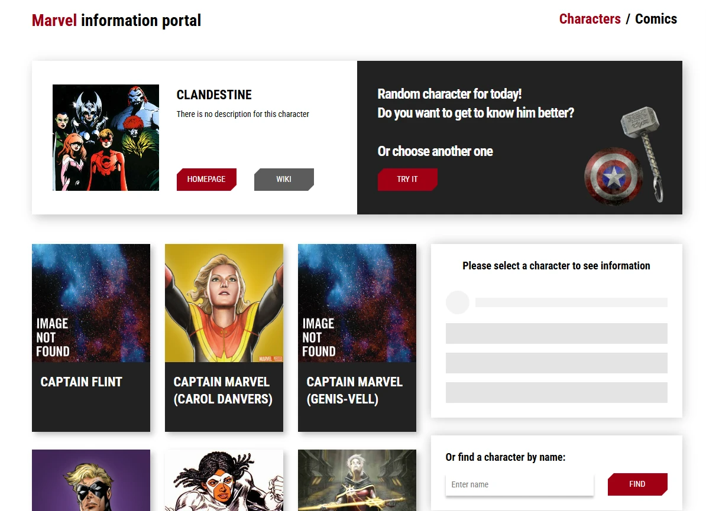

Конечно! Вот англоязычная версия `README.md` для твоего проекта **MarvelApp**:

---

# 🚀 MarvelApp

A single-page application (SPA) built with **React** that allows users to explore characters and comics from the Marvel Universe. Data is fetched via the official [developer.marvel.com](https://developer.marvel.com/) API.

This project was developed as part of a Udemy React course and serves as hands-on practice for working with modern React tools and libraries.

---

## ✨ Features

- 🔍 Search for Marvel characters by name  
- 👾 View detailed character information  
- 📚 Explore all comics a character appears in  
- 🎲 Load a random character  
- 🧾 View detailed comic information  

---

## 🧰 Technologies Used

- **React 18** – UI library  
- **React Router v5** – Client-side routing  
- **Formik + Yup** – Form management and validation  
- **SASS** – Styling with preprocessor  
- **React Helmet** – Manage document head (meta tags, titles)  
- **React Transition Group** – Animations and transitions  
- **PropTypes** – Type-checking for React props  

---

## 📦 Getting Started

1. Clone the repository:
   ```bash
   git clone https://github.com/your_username/marvel-app.git
   cd marvel-app
   ```

2. Install dependencies:
   ```bash
   npm install
   ```

3. Create a `.env` file in the root and add your Marvel API key:
   ```
   REACT_APP_MARVEL_API_KEY=your_api_key
   ```

4. Start the development server:
   ```bash
   npm start
   ```

---

## 📷 Screenshots



---

## 📚 Course Reference

Built while taking a React course on **Udemy**.

---

## 📄 License

This project is for educational purposes only. All rights to Marvel characters and content belong to **Marvel Entertainment, LLC**.
